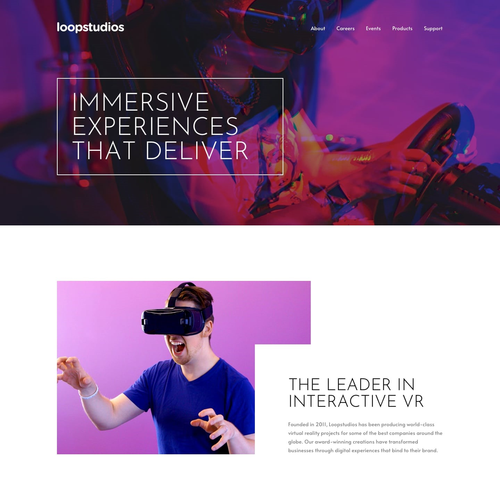
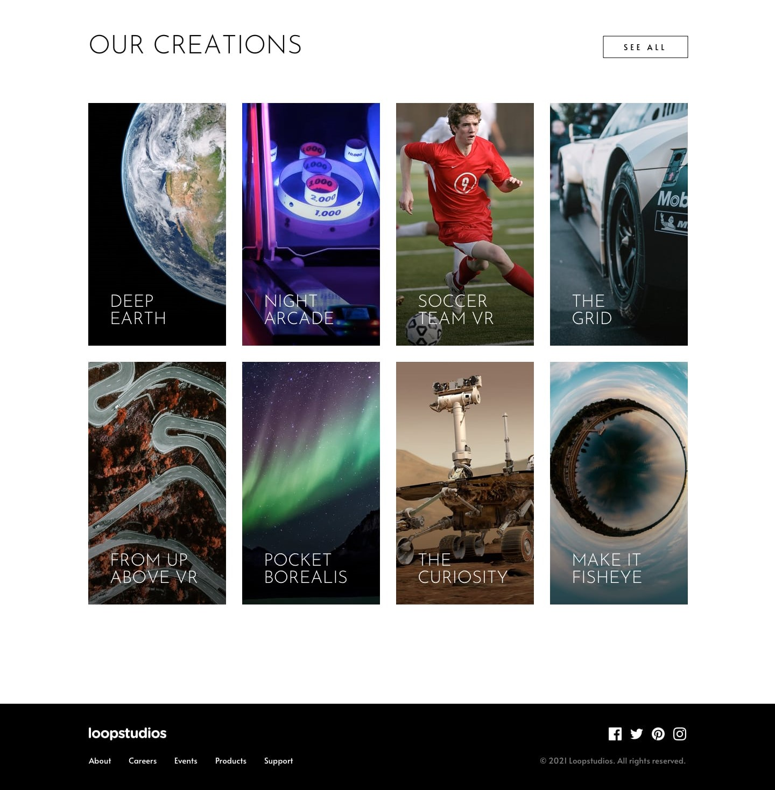

# Frontend Mentor - Loopstudios Landing Page Solution

This is a solution to the [Loopstudios landing page challenge on Frontend Mentor](https://www.frontendmentor.io/challenges/loopstudios-landing-page-N88J5Onjw). Frontend Mentor challenges help you improve your coding skills by building realistic projects.

## Table of Contents

- [Overview](#overview)
  - [The Challenge](#the-challenge)
  - [Screenshot](#screenshot)
- [My Process](#my-process)
  - [Built With](#built-with)
  - [What I Learned](#what-i-learned)
- [Author](#author)

## Overview

### The Challenge

Users should be able to:

- View the optimal layout for the site depending on their device's screen size
- See hover states for all interactive elements on the page

### Screenshot

  

  

## My Process

### Built With

- [React](https://reactjs.org/) - JS library
- [Vite](https://vitejs.dev/) - Build tool
- [Tailwind CSS](https://tailwindcss.com/) - For styles
- Semantic HTML5 markup
- Flexbox
- CSS Grid
- Mobile-first workflow

### What I Learned

This project helped me improve my skills in:

- Implementing responsive design using Tailwind CSS
- Creating interactive elements with hover states
- Structuring a React application with reusable components
- Using CSS Grid for layout in the Creations section
- Implementing a mobile navigation menu with React state

## Author

- Frontend Mentor - [@yourusername](https://www.frontendmentor.io/profile/rohanvron)

